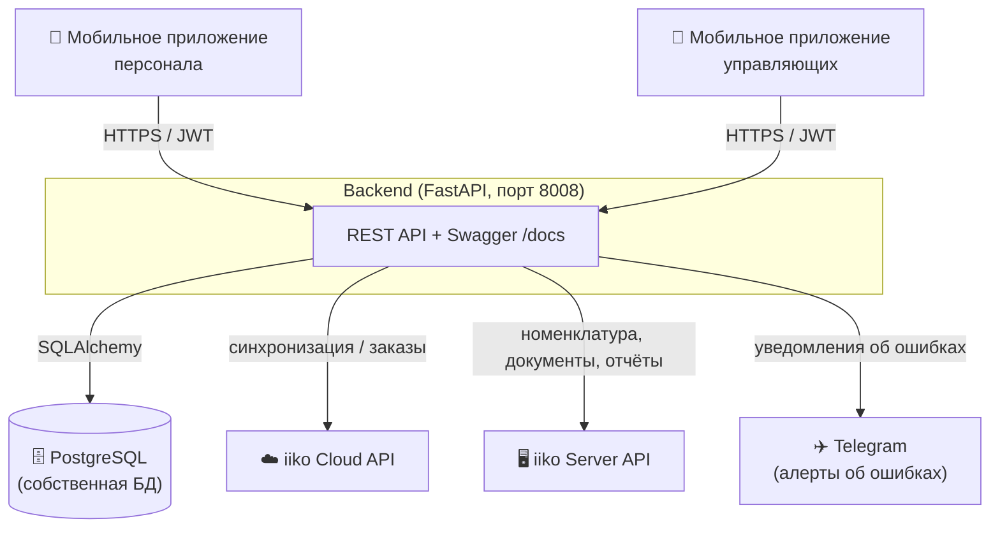
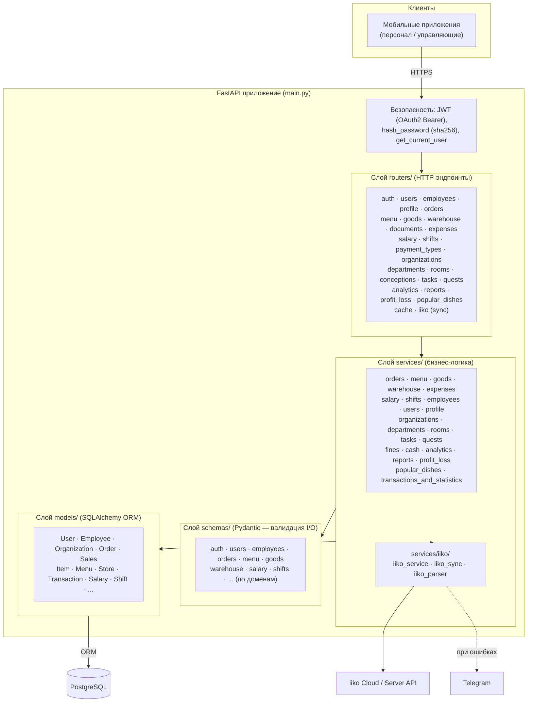
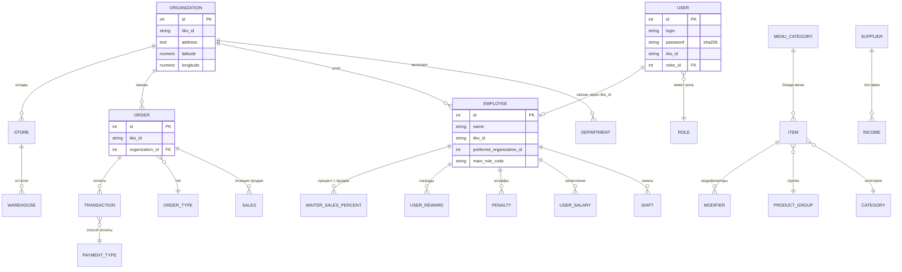
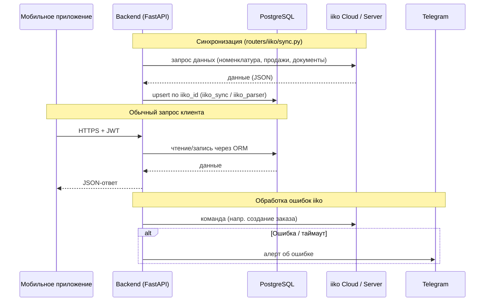

# Архитектура информационной системы

Серверная часть (backend) информационной системы для управления сетью ресторанов
с интеграцией iiko. Документ описывает контекст системы, слоистую архитектуру
backend-приложения, схему базы данных и логику внешних интеграций.

- **Стек:** Python 3.12, FastAPI, SQLAlchemy (sync ORM), PostgreSQL
- **Внешние интеграции:** iiko Cloud API, iiko Server API, Telegram (алерты)
- **Клиенты:** мобильное приложение для персонала, мобильное приложение для управляющих

---

## 1. Контекст системы (System Context)

Система выступает промежуточным слоем между мобильными приложениями и iiko:
данные из iiko синхронизируются в собственную БД, а клиентские приложения
работают только с backend-API, не обращаясь к iiko напрямую.

---

## 2. Слоистая архитектура backend

**Принцип:** запрос проходит `router → service → model/schema`.
Routers отвечают только за HTTP и авторизацию, бизнес-логика сосредоточена в
services, доступ к данным — через ORM-модели, контракты API описаны схемами Pydantic.

---

## 3. Схема базы данных (основные сущности)

> У каждой сущности есть собственный `id`, у многих — `iiko_id` (UUID из iiko)
> для сопоставления с данными iiko.

> Диаграмма отражает ключевые сущности и связи доменной модели; полный перечень
> таблиц — в каталоге `models/` (~40 моделей), детали миграций — в `migrations/`.

---

## 4. Логика интеграции с iiko

Клиент iiko (`services/iiko/iiko_service.py`) работает с тремя типами API
(перечисление `IikoApiType`):

| Тип | Назначение | Авторизация |
|-----|-----------|-------------|
| `CLOUD` | стандартный iiko Cloud API | Bearer-токен (apiLogin) |
| `CLOUD_OLD` | старый ключ Cloud API (для заказов) | Bearer-токен |
| `SERVER` | iiko Server API (номенклатура, документы, отчёты) | логин/пароль |

**Ключевые особенности интеграции:**
- Данные iiko синхронизируются в собственную БД и сопоставляются по `iiko_id`.
- Между запросами к iiko выдерживаются задержки (`*_REQUEST_DELAY`), чтобы не
  перегружать кассовый контур.
- После команд в iiko Cloud выполняется поллинг статуса; при ошибке/таймауте
  отправляется Telegram-алерт.

---

## 5. Безопасность и доступ

- Аутентификация — JWT (OAuth2 Bearer), выдача токена через `create_access_token`.
- Пароли хранятся как `sha256`-хеш (`hash_password`).
- Зависимость `get_current_user` защищает эндпоинты, требующие авторизации.
- Swagger UI (`/docs`), ReDoc (`/redoc`) и `/openapi.json` закрыты Basic Auth.
- Ролевая модель доступа — через `roles` / `main_role_code` (персонал vs управляющие).
